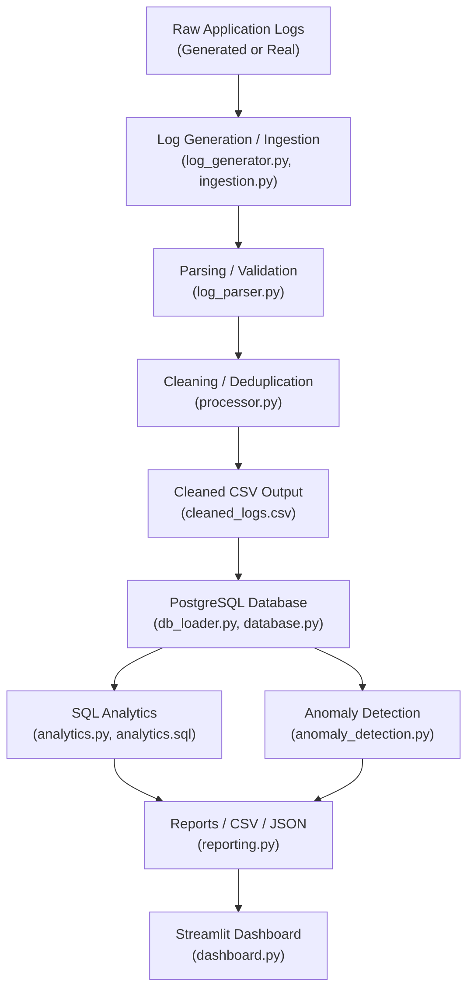

# LogFlow Architecture

## System Overview

LogFlow is a Python-based log processing and anomaly detection pipeline. It generates, parses, stores, analyzes, and visualizes application log data.

## Architecture Diagram

## Module Responsibilities

| Module | File | Purpose |
|--------|------|---------|
| Configuration | `app/config.py` | Environment variables, paths, database settings |
| Log Generator | `app/log_generator.py` | Generates realistic synthetic application logs |
| Ingestion | `app/ingestion.py` | Reads raw log files into memory |
| Log Parser | `app/log_parser.py` | Parses pipe-delimited log lines into structured records |
| Processor | `app/processor.py` | Validates, cleans, deduplicates parsed records |
| Database | `app/database.py` | PostgreSQL connection management |
| DB Loader | `app/db_loader.py` | Loads cleaned CSV into PostgreSQL with batch inserts |
| Analytics | `app/analytics.py` | Runs 13 SQL analytics queries against PostgreSQL |
| Anomaly Detection | `app/anomaly_detection.py` | Isolation Forest + rule-based anomaly detection |
| Reporting | `app/reporting.py` | Generates data quality, operational, and final reports |
| Dashboard | `dashboard.py` | Streamlit interactive web dashboard |
| CLI | `run.py` | Command-line interface for all pipeline stages |

## Data Flow

1. **Generate**: `log_generator.py` creates synthetic log lines in `data/input/application.log`
2. **Ingest**: `ingestion.py` reads the raw log file into a list of strings
3. **Parse**: `log_parser.py` splits each line on `|` and extracts structured fields
4. **Validate**: `processor.py` checks required fields, value ranges, and rejects invalid records
5. **Clean**: `processor.py` removes duplicates and outputs `cleaned_logs.csv`
6. **Load**: `db_loader.py` reads the CSV, computes record hashes, and inserts into PostgreSQL
7. **Analyze**: `analytics.py` runs SQL queries for log level distribution, error rates, response times, etc.
8. **Detect**: `anomaly_detection.py` uses Isolation Forest on engineered features + rule-based signals
9. **Report**: `reporting.py` combines analytics, anomalies, and data quality into final reports
10. **Visualize**: `dashboard.py` displays everything in an interactive Streamlit web app

## Key Design Decisions

- **Pipe-delimited format**: Chosen for readability and easy parsing with `split("|")`
- **Record hashing**: SHA-256 hash enables idempotent database loading (ON CONFLICT DO NOTHING)
- **Separate validation from parsing**: Parsing extracts fields; validation enforces business rules
- **Deterministic anomaly detection**: Fixed `random_state` ensures reproducible results
- **SQL analytics**: Leverages PostgreSQL aggregation capabilities for operational insights
- **Isolation Forest**: Unsupervised ML that does not require labeled anomaly data
